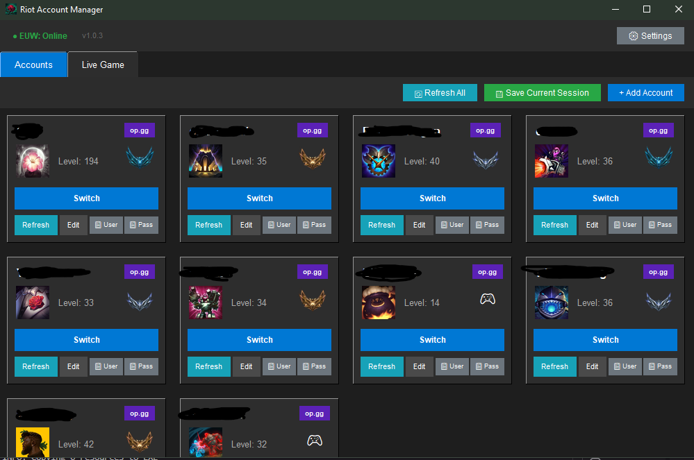

# Riot Account Manager

A comprehensive League of Legends account management tool with live game tracking, rank monitoring, and summoner spell tracking.




## Features

### Account Management
- Manage unlimited League of Legends accounts
- Quick account switching with one click
- Session management to avoid re-entering credentials
- Custom display names and account organization
- Password storage for quick copy (optional)

### Rank & Stats (requires Riot API key)
- Automatic rank fetching (tier, division, LP)
- Visual rank badges
- Win/Loss statistics with win rate
- Summoner level display
- Profile icons
- Champion mastery points

### Live Game Features (requires Riot API key)
- Real-time game detection
- Complete team overview (all 10 players)
- Lane-based organization
- Champion information with icons
- Rank analysis for all players
- Ban phase display
- Clickable player names (op.gg links)
- Streamer mode detection

### Summoner Spell Tracker (requires Riot API key)
- Track enemy summoner spell cooldowns
- Automatic Cosmic Insight rune detection
- Click to start/stop timers
- Visual countdown on spell icons
- Supports: Flash, Heal, Barrier, Ignite, Exhaust

### Server Status (requires Riot API key)
- Real-time server status monitoring
- Region selection
- Incident tracking
- Auto-updates every 10 minutes

### 🔄 Auto-Update
- Automatic new version detection
- One-click update download
- Release notes display

## Installation

### Prerequisites
- Python 3.8 or higher
- Riot Games API key (get one at [Riot Developer Portal](https://developer.riotgames.com/))

### Setup

1. Clone the repository:
```bash
git clone https://github.com/yourusername/riot-account-manager.git
cd riot-account-manager
```

2. Install dependencies:
```bash
pip install -r requirements.txt
```

3. Run the application:
```bash
python main.py
```

4. Configure your Riot API key in Settings

## Building Executable

To create a standalone .exe file:

1. Install build requirements:
```bash
pip install -r build_requirements.txt
```

2. Run the build script:
```bash
python build_exe.py
```

Or use the batch file:
```bash
build.bat
```

The executable will be created in the `dist` folder.

## Configuration

### API Key
1. Get your API key from [Riot Developer Portal](https://developer.riotgames.com/)
2. Open Settings in the application
3. Enter your API key and select your region
4. Click Save

### Adding Accounts
1. Click "+ Add Account"
2. Enter your username (session ID)
3. Optionally add display name, Riot ID, and password
4. Click "Add Account"

## Usage

### Account Switching
- Click "Switch" on any account card to switch to that account
- The application will handle the session switching automatically

### Live Game Tracking
1. Go to the "Live Game" tab
2. Select an account from the dropdown
3. Click "Refresh" to fetch current game data
4. Use the spell tracker on the right to track enemy summoner spells

### Spell Tracker
- Click on an enemy's summoner spell icon to start the cooldown timer
- The timer automatically adjusts for Cosmic Insight rune
- Click again to reset the timer

## Project Structure

```
riot-account-manager/
├── main.py                 # Application entry point
├── version.py             # Version information
├── update_checker.py      # Auto-update functionality
├── account_manager.py     # Account data management
├── riot_switcher.py       # Account switching logic
├── rank_fetcher.py        # Rank data fetching
├── live_game_fetcher.py   # Live game data fetching
├── config.py              # Configuration management
├── gui/                   # GUI components
│   ├── main_window.py
│   ├── account_card.py
│   ├── live_game_display.py
│   ├── update_dialog.py
│   └── ...
├── assets/                # Icons and images
└── requirements.txt       # Python dependencies
```


## License

This project is licensed under the MIT License - see the LICENSE file for details.

## Disclaimer

This application is not endorsed by Riot Games and does not reflect the views or opinions of Riot Games or anyone officially involved in producing or managing Riot Games properties. Riot Games and all associated properties are trademarks or registered trademarks of Riot Games, Inc.